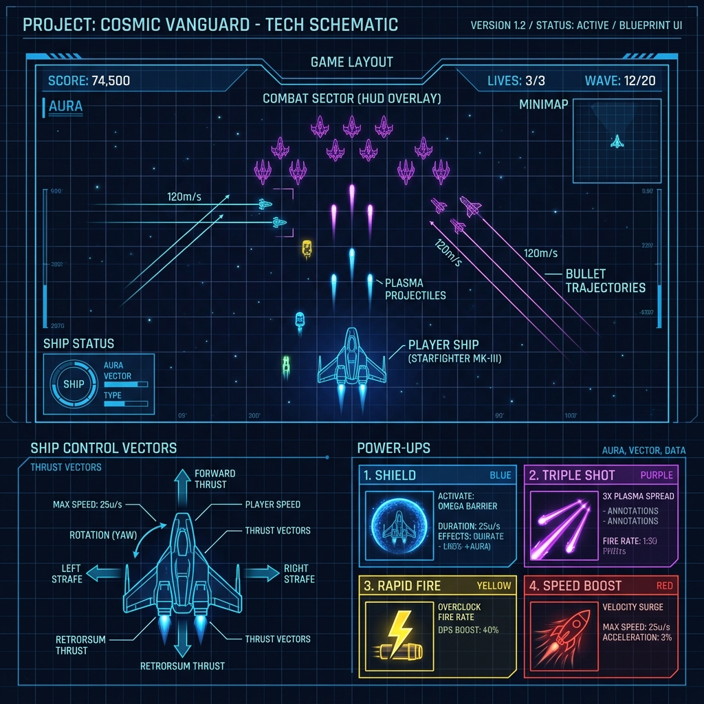
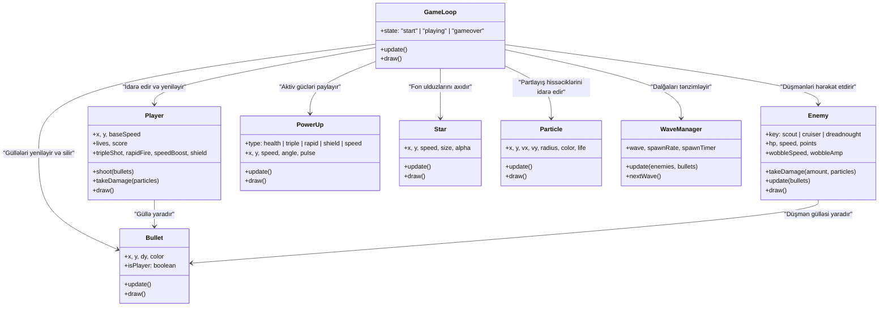

# 🚀 Space Shooter

A browser-based arcade game built with **pure HTML, CSS, and vanilla JavaScript** — no libraries, no frameworks, no game engines.

 

---

## 📖 Game Description

You pilot a lone starship defending against endless waves of alien invaders. Three enemy types with increasing difficulty spawn in escalating waves. Survive as long as possible, destroy as many enemies as you can, and beat your high score!

### 🎮 Entities

| Entity | Description |
|---|---|
| **Player** | Purple spaceship controlled by keyboard. Has 3 lives. |
| **Scout** | Fast red diamond — 1 HP, 10 pts |
| **Cruiser** | Medium orange hexagon — 3 HP, 30 pts |
| **Dreadnought** | Slow purple octagon — 6 HP, 60 pts |
| **Player Bullet** | Cyan laser fired upward |
| **Enemy Bullet** | Colored plasma shot fired downward |
| **Particle** | Explosion debris on death or hit |
| **Star** | Scrolling background parallax decoration |

### 🖼️ Game Sketch & Blueprint (Excalidraw)




### 📐 Architecture & Data Flow (Excalidraw Diagram)

Below is the design and architecture blueprint showing the game loop, player states, HUD updates, and the dynamic power-up reactive system:

```mermaid
graph TD
    %% Base Styles
    classDef loop fill:#111,stroke:#7b2fff,stroke-width:2px,color:#fff;
    classDef player fill:#1d4ed8,stroke:#60a5fa,stroke-width:2px,color:#fff;
    classDef powerup fill:#0f172a,stroke:#facc15,stroke-width:2px,color:#fff;
    classDef system fill:#064e3b,stroke:#00ff88,stroke-width:2px,color:#fff;
    classDef UI fill:#1e1b4b,stroke:#a78bfa,stroke-width:2px,color:#fff;

    %% Elements
    GameLoop["🔄 Core Game Loop (gameLoop / update / draw)"]:::loop
    PlayerInput["⌨️ Player Inputs (Keys W/A/S/D / Space)"]:::player
    PlayerState["🚀 Player Entity (x, y, lives, speedBoost, shield, rapidFire, tripleShot)"]:::player
    PowerUpManager["⚡ Power-up Spawn Engine (spawns random PowerUp)"]:::powerup
    PowerUpCollision["💥 Collision Detector (AABB)"]:::system
    
    subgraph Reactive Skins (Visual Feedback)
        DynamicSkin["🎨 Dynamic Renderer (draw)"]:::player
        DefaultPurple["💜 Purple Default Skin"]:::player
        ShieldBlue["💙 Blue Qalxan (Shield)"]:::player
        TriplePurple["💜 Purple Triple Shot"]:::player
        RapidYellow["💛 Yellow Sürətli Atəş (Rapid)"]:::player
        SpeedRose["❤️ Rose Sürətli Hərəkət (Speed)"]:::player
    end

    subgraph User Interface (HUD)
        HUD_Score["🏆 HUD Score & HighScore"]:::UI
        HUD_Lives["❤️ HUD Lives Indicator"]:::UI
        HUD_Powerups["📊 Power-up Status Badges & Timers"]:::UI
    end

    %% Flow Connections
    GameLoop -->|"1. Poll Input"| PlayerInput
    PlayerInput -->|"2. Update Position / Shoot"| PlayerState
    GameLoop -->|"3. Auto Spawn Every ~8s"| PowerUpManager
    PowerUpManager -->|"Spawn Object"| PowerUpCollision
    PlayerState -->|"Verify Collision"| PowerUpCollision
    
    PowerUpCollision -->|"Apply Buffs"| PlayerState
    
    PlayerState -->|"4. Draw Ship Structure"| DynamicSkin
    DynamicSkin -->|"Check Shield"| ShieldBlue
    DynamicSkin -->|"Check TripleShot"| TriplePurple
    DynamicSkin -->|"Check RapidFire"| RapidYellow
    DynamicSkin -->|"Check SpeedBoost"| SpeedRose
    DynamicSkin -->|"No Active Powerup"| DefaultPurple

    PlayerState -->|"5. Update HUD Info"| HUD_Powerups
    PlayerState -->|"Update Canlar"| HUD_Lives
```

---

## 🕹️ How to Play

### Controls

| Key | Action |
|---|---|
| `W` / `↑` | Move Up |
| `S` / `↓` | Move Down |
| `A` / `←` | Move Left |
| `D` / `→` | Move Right |
| `SPACE` | Shoot |

### Objective

- Destroy enemies before they pass through or ram you
- Each wave ends after a set number of kills — waves get harder
- You have **3 lives** — enemies that touch you or hit you with bullets take a life
- After losing all lives → **Game Over**

### Win / Lose

- **Lose:** All 3 lives gone → Game Over screen
- **Win:** There is no final win — it's a high-score survival game
- **High Score** is saved locally and persists between sessions

---

## ⚙️ Tech Decisions

### OOP (Object-Oriented Programming)

I chose **OOP** because:

1. Each game entity has its own **state** (position, HP, speed) and **behavior** (update, draw, shoot)
2. Classes make it easy to create many instances of the same type (e.g., `new Enemy(...)`)
3. Inheritance is clean: a `Bullet` knows if it's a player or enemy bullet via a property
4. Easier to debug — each object is self-contained

### Class Structure

Below is the Object-Oriented Programming (OOP) class diagram showing all major classes, their properties/methods, and their associations:




### Game Loop

```js
function gameLoop() {
  update(); // move everything, check collisions
  draw();   // clear canvas, render all entities
  requestAnimationFrame(gameLoop);
}
```

### Collision Detection

AABB (Axis-Aligned Bounding Box):

```js
function collides(a, b) {
  return (
    a.x < b.x + b.width  && a.x + a.width  > b.x &&
    a.y < b.y + b.height && a.y + a.height > b.y
  );
}
```

---

## 🔗 Links

- **GitHub Repo:** [ilkinismayilov-905/GameProject](https://github.com/ilkinismayilov-905/GameProject)
- **AI Diary:** [AI_DIARY.md](./AI_DIARY.md)
- **Live Game (GitHub Pages):** [https://ilkinismayilov-905.github.io/GameProject/](https://ilkinismayilov-905.github.io/GameProject/)

---

## 🐛 Known Bugs / What I'd Fix Next

| Issue | Notes |
|---|---|
| Enemy bullets ignore canvas resize | Bullet position is set at spawn time |
| No sound | Would add Web Audio API sfx |
| Mobile controls missing | Would add on-screen touch buttons |
| Wave number in HUD flickers briefly | Minor re-render timing issue |
| No power-ups | Would add shield, rapid fire, triple shot |
| Enemies can stack at same X | Spawn RNG can produce overlapping enemies |

---

## 📁 File Structure

```
space-shooter/
├── index.html     ← Game entry point
├── style.css      ← All styling (no frameworks)
├── game.js        ← Full game logic (OOP, Canvas API)
├── README.md      ← This file
└── AI_DIARY.md    ← AI development log
```
